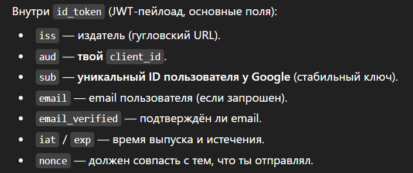

# Регистрация через Google

---

1. ### Пользователь нажимает кнопку «Зарегистрироваться через Google». Браузер делает запрос на бэкэнд (фронтенд отправляет пользователя на мой эндпоинт).

2. ### Мой бэкэнд делает редирект на Google. Редиректит он одновременно с client_id (выданный Google id, так Google понимает, от какого приложения идет запрос на регистрацию), redirect_uri (обратный путь), списком прав (scope), который запрашивается у Google, и со специальными строками, которые защитят от атак, от перехватов (state, nonce). Если ушли те же строки, что и пришли, значит подмены не было (одна из этих строк клеится к токену, но это не важно).

3. ### Google возвращает на переданный ему ранее редирект URI одноразовый код (code) и строку (state), которая доказывает, что данные не были подменены. 

4. ### Далее, мой сервер делает запрос на специальный эндпоинт Google по сервисному защищенному (зашифрованному + проверка сертификата Google) каналу (сервисный POST), и передает по этому каналу ранее выданный Google code, client-id, специальный Google-secret (который был изначально выдан самим Google), и тот же redirect-uri, который должен просто совпасть с тем же, что был на этапе авторизации. 

5. ### Google убедится, что Google-secret совпадает с изначальным, который он отправлял при регистрации приложения и вышлет JSON с scope (какие скоупы реально выданы), token_type (обычно "Bearer"), access_type=offline (Нужен, чтобы получать новые access_token без повторного логина у Google), id_token (JWT от Google (основной для входа по OIDC). Его содержимое (payload) после валидации ты используешь, чтобы создать/найти пользователя).

6. ### Id token

7. ### Проверка полученного токена, нашел/создал пользователя, сформировал свой jwt, отдал его фронту.
---
